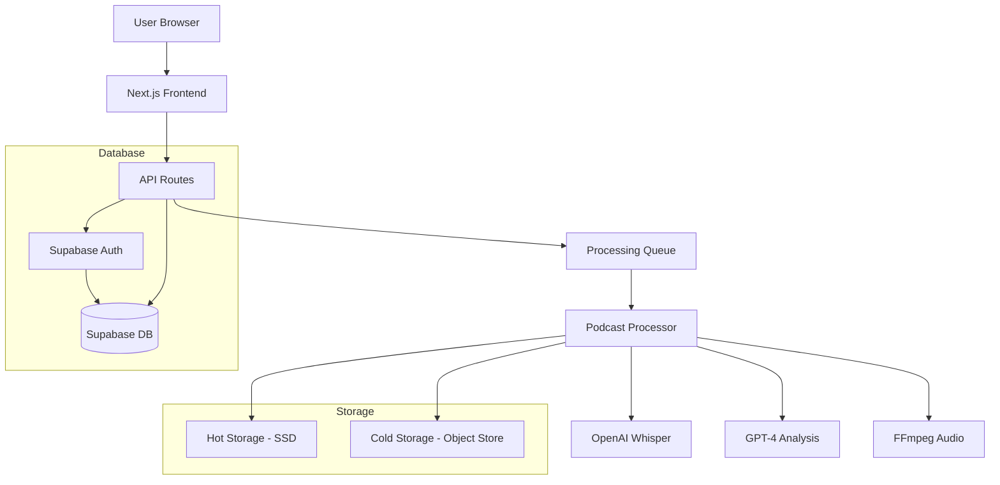

# System Architecture

This diagram shows:
1. User interaction flow
2. Processing pipeline
3. Storage strategy
4. Database connections

When we start coding, we'll implement each of these components in actual code. 