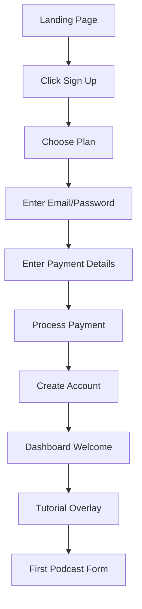
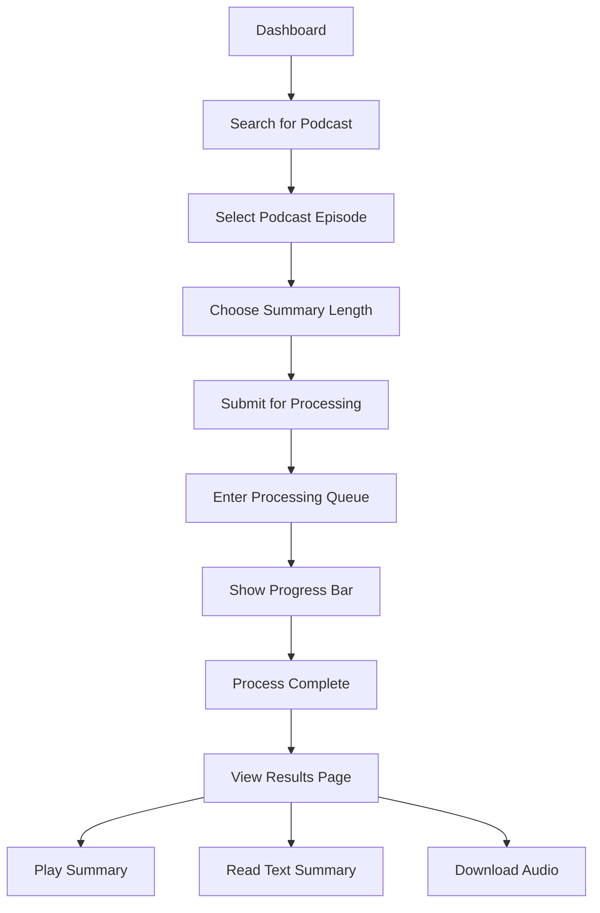
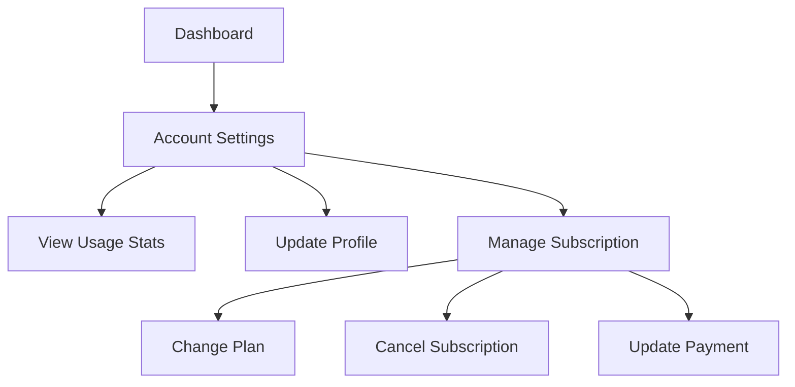
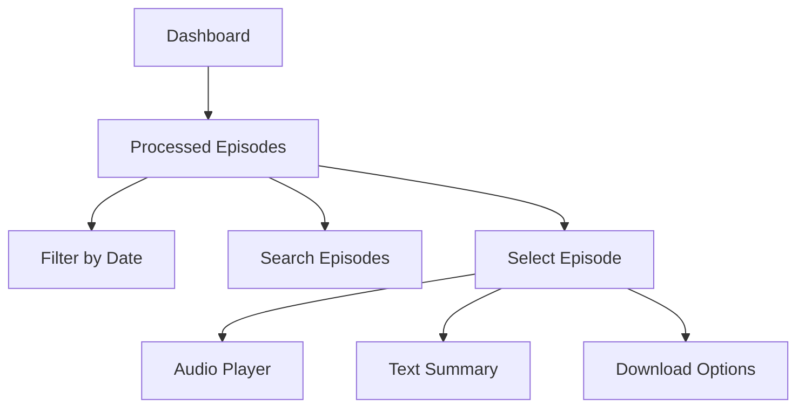
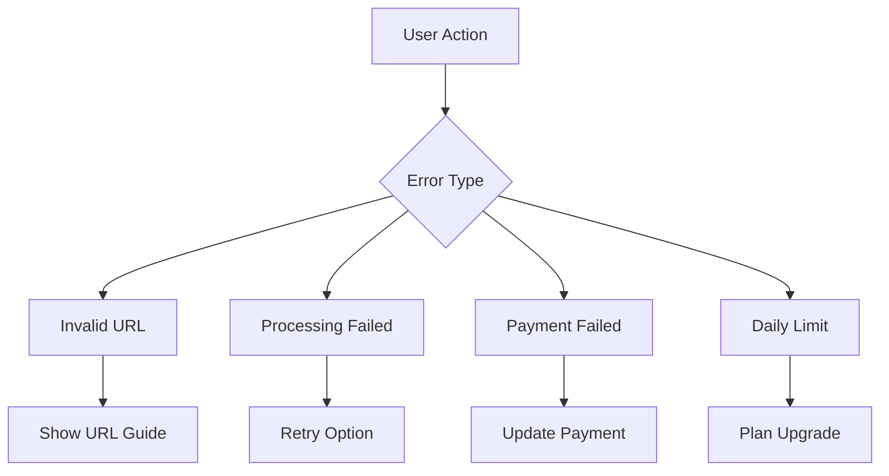

# User Flows

## 1. New User Registration Flow

## 2. Podcast Processing Flow

## 3. Account Management Flow

## 4. Content Access Flow

## 5. Error Handling Flow

## Detailed Flow Descriptions

### 1. New User Registration
1. User lands on homepage
2. Clicks "Sign Up" or "Get Started"
3. Chooses between Monthly/Lifetime plan
4. Enters email and password
5. Provides payment information
6. Account created and payment processed
7. Redirected to dashboard
8. Sees welcome tutorial
9. Prompted to process first podcast

### 2. Podcast Processing
1. User navigates to dashboard
2. Searches for a podcast using in-app search (public metadata/RSS)
3. Selects a podcast episode from results
4. User selects desired summary length
5. Submits for processing
6. Sees position in queue
7. Views real-time progress
8. Receives completion notification
9. Accesses audio and text summaries

### 3. Account Management
1. User accesses account settings
2. Views current plan details
3. Checks usage statistics
4. Can update profile information
5. Manages subscription settings
6. Updates payment method if needed
7. Views processing history

### 4. Content Access
1. User views processed episodes
2. Can filter by date range
3. Searches for specific episodes
4. Selects episode to view
5. Plays summarized audio
6. Reads text summary
7. Downloads content if desired

### 5. Error Resolution
1. System detects error
2. Shows specific error message
3. Provides resolution steps
4. Offers support options
5. Tracks error for analytics
6. Suggests alternatives

## Success Metrics

### Key Performance Indicators (KPIs)
1. Registration completion rate
2. Processing success rate
3. Daily active users
4. Average processing time
5. User retention rate
6. Error resolution rate

### User Experience Metrics
1. Time to first podcast
2. Navigation efficiency
3. Error frequency
4. Support ticket volume
5. Feature adoption rate
6. User satisfaction score 